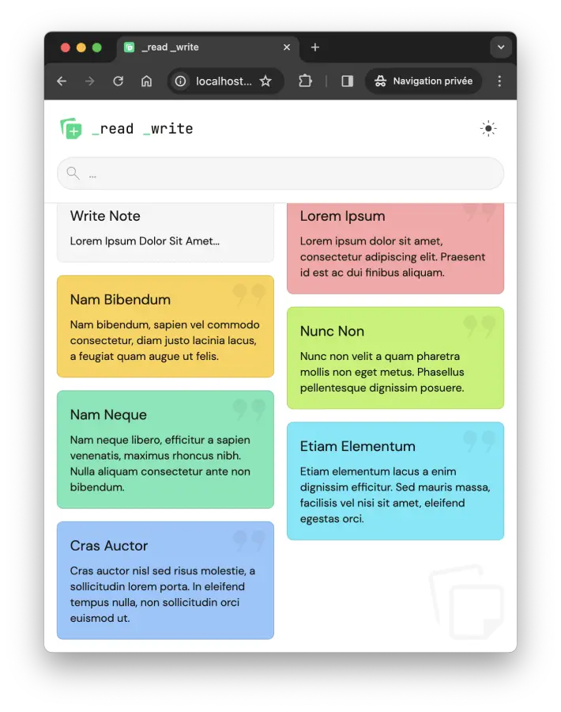
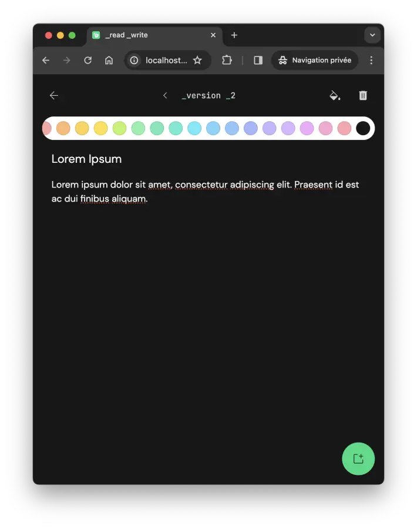

# _Read _Write _App

> 0.1.0

Another note-taking application ("_Keep Like_"), based on the **Vue** framework and the State Management library [Pinia](https://pinia.vuejs.org)

Dealing with the Fine-Grained Reactivity of **SolidJS**: `useSignal` / `useComputed`

## Features

Each note is "versioned", so it's possible to return to the previous version and/or the next one, as long as there is no new version...

When editing an earlier note, later notes are deleted; or when adding a new version (manually).

## Preview




## Process

Repository:

```
git clone https://github.com/DmnChzl/ReadWrite.git
```

Install:

```
pnpm install
```

Server:

```
pnpm run start:server
```

Dev:

```
pnpm run dev
```

Test:

```
pnpm run test:unit

Test Files  5 passed (5)
     Tests  10 passed (10)
  Start at  08:43:38
  Duration  4.96s (transform 461ms, setup 4.23s, collect 2.70s, tests 478ms, environment 6.02s, prepare 745ms)
```

Build:

```
pnpm run build

✓ built in 2.21s
```

Enjoy! 👌

## License

```
"THE BEER-WARE LICENSE" (Revision 42):
<phk@FreeBSD.ORG> wrote this file. As long as you retain this notice you
can do whatever you want with this stuff. If we meet some day, and you think
this stuff is worth it, you can buy me a beer in return. Damien Chazoule
```